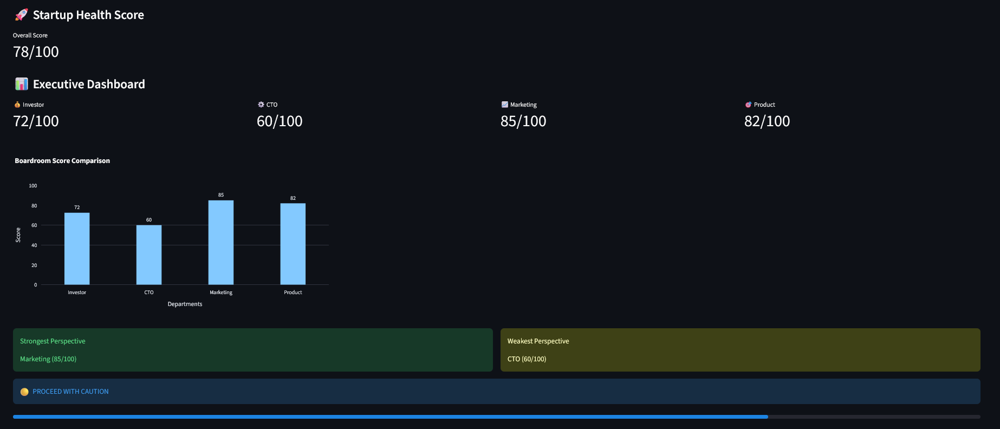
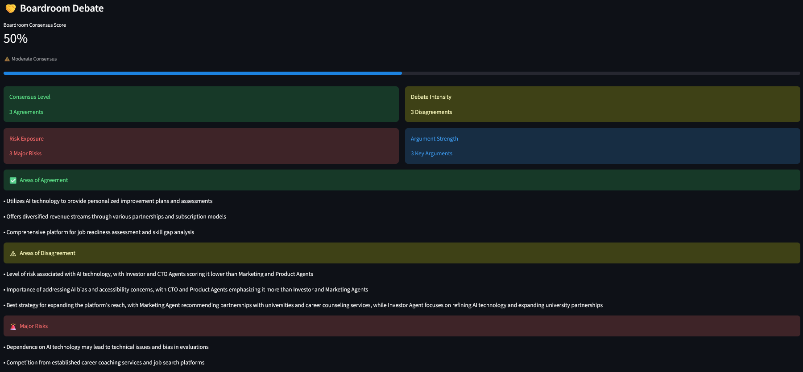
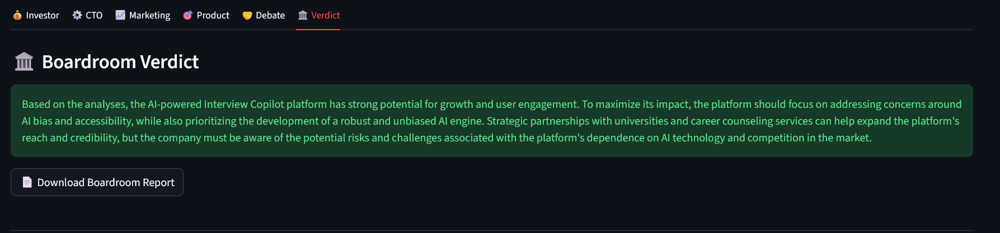

# 🚀 AI Startup Boardroom

An AI-powered Multi-Agent Decision Support System that simulates a startup boardroom.

The platform evaluates startup ideas through multiple specialized AI agents including Investor, CTO, Marketing, Product, Debate, and Summary agents.

Each agent analyzes the startup from a different perspective, participates in a boardroom-style discussion, and contributes to a final investment recommendation.

The system provides:

- 📊 Executive Dashboard
- 🤝 Boardroom Debate & Consensus Analysis
- 📈 Interactive Visualizations
- 🏛️ Final Boardroom Verdict
- 📄 Downloadable PDF Reports

Built using Groq, Llama 3.3 70B, Streamlit, Plotly, and Multi-Agent AI Architecture.

## System Architecture

```text
User Startup Idea
        │
        ▼
 ┌─────────────────┐
 │ Investor Agent  │
 └─────────────────┘
        │
        ▼
 ┌─────────────────┐
 │   CTO Agent     │
 └─────────────────┘
        │
        ▼
 ┌─────────────────┐
 │ Marketing Agent │
 └─────────────────┘
        │
        ▼
 ┌─────────────────┐
 │ Product Agent   │
 └─────────────────┘
        │
        ▼
 ┌─────────────────┐
 │  Debate Agent   │
 └─────────────────┘
        │
        ▼
 ┌─────────────────┐
 │ Summary Agent   │
 └─────────────────┘
        │
        ▼
 Executive Dashboard
        │
        ▼
 Final Verdict + PDF Report
```


## Screenshots

### Executive Dashboard



The Executive Dashboard provides department-wise startup evaluation scores, overall startup health score, and visual comparison charts.

### Boardroom Debate



The Debate Agent simulates a boardroom discussion by identifying agreements, disagreements, risks, key arguments, and a consensus score across all executive agents.

### Final Verdict



The Summary Agent generates the final boardroom verdict and investment recommendation, along with downloadable PDF reports.


## Overview

AI Startup Boardroom is a project that explores how multiple AI agents can collaborate to evaluate startup ideas.

When a startup idea is submitted, different AI agents analyze it from their own perspective. Each agent focuses on a specific business function and provides feedback, observations, and a score. These individual evaluations are then combined to generate a final boardroom verdict and investment recommendation.

The goal of this project was to understand how multi-agent AI systems can be used for decision-making tasks while gaining hands-on experience with prompt engineering, LLM orchestration, and Streamlit application development.

The current version includes:

* Investor Agent
* CTO Agent
* Marketing Agent
* Product Agent
* Summary Agent
* Debate Agent

The system simulates an AI-powered boardroom where multiple executive agents evaluate a startup idea, debate opportunities and risks, and generate a final investment recommendation.

---

## Features

### Investor Agent

Evaluates:

* Market Potential
* Revenue Potential
* Scalability
* Investment Risk

### CTO Agent

Evaluates:

* Technical Feasibility
* Infrastructure Complexity
* Security Risks
* Development Cost

### Marketing Agent

Evaluates:

* Market Demand
* Customer Acquisition Strategy
* Competitive Positioning
* Growth Potential

### Product Agent

Evaluates:

* Product-Market Fit
* User Value Proposition
* Product Differentiation
* Adoption Potential

### Summary Agent

Generates:

* Executive Summary
* Agreements
* Disagreements
* Opportunities
* Risks
* Final Verdict

---

## Dashboard Features

* Multi-Agent Startup Evaluation
* Executive Dashboard
* Department-wise Scoring
* Boardroom Health Score
* Investment Recommendation Engine
* Interactive Radar Charts
* Score Comparison Dashboard
* Debate Agent & Consensus Analysis
* Downloadable PDF Boardroom Reports

---

## Tech Stack

* Python
* Streamlit
* Groq API
* Llama 3.3 70B
* Plotly
* Pandas
* ReportLab
* Git
* GitHub
* Multi-Agent Architecture
* Prompt Engineering

---

## Project Structure

```text
```text
ai-startup-boardroom/

├── agents/
│   ├── base_agent.py
│   ├── investor.py
│   ├── cto.py
│   ├── marketing.py
│   ├── product.py
│   ├── debate.py
│   └── summary.py
│
├── components/
│   ├── agent_cards.py
│   ├── charts.py
│   └── dashboard.py
│
├── prompts/
│   ├── investor_prompt.txt
│   ├── cto_prompt.txt
│   ├── marketing_prompt.txt
│   ├── product_prompt.txt
│   ├── debate_prompt.txt
│   └── summary_prompt.txt
│
├── services/
│   ├── scoring.py
│   ├── pdf_generator.py
│   └── report_generator.py
│
├── screenshots/
│   ├── dashboard.png
│   ├── debate.png
│   └── verdict.png
│
├── streamlit_app.py
├── requirements.txt
├── README.md
└── .gitignore
```

```

---

## How It Works

1. The user submits a startup idea.
2. The Investor Agent evaluates business and investment potential.
3. The CTO Agent evaluates technical feasibility.
4. The Marketing Agent analyzes market opportunities.
5. The Product Agent evaluates product viability.
6. Individual scores are generated for each department.
7. The system calculates an overall Boardroom Score.
8. The Summary Agent combines all evaluations into a final verdict.
9. Results are displayed through an interactive dashboard and can be exported as a PDF report.

---

## Contributors

* Divyam Jariwal

---

## What I Learned

While building this project, I gained hands-on experience with:

* Multi-Agent AI Systems
* Prompt Engineering
* LLM Orchestration
* Streamlit Development
* Data Visualization with Plotly
* PDF Report Generation
* End-to-End AI Application Development

This project was developed as part of my M.Tech journey in Artificial Intelligence and Machine Learning.
