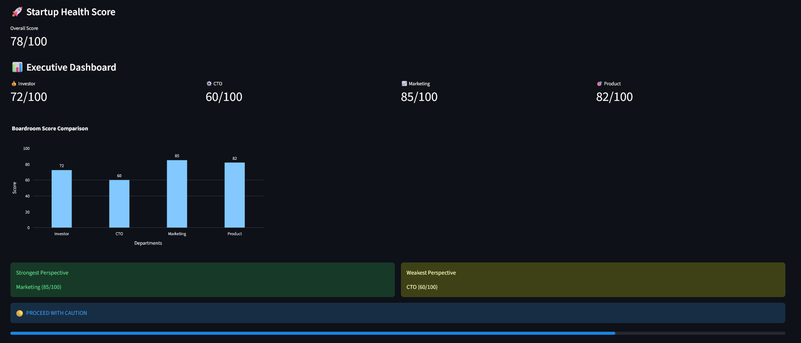
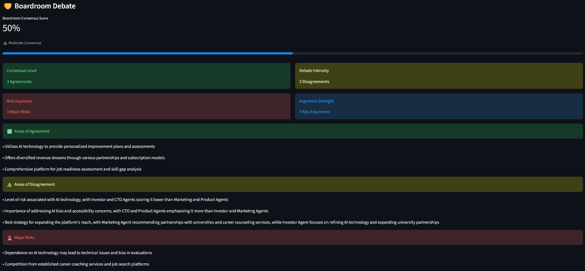
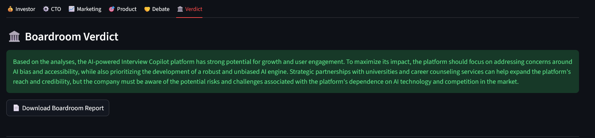

# AI Startup Boardroom

AI Startup Boardroom is a Streamlit decision-support application that evaluates a startup idea from multiple executive perspectives. It combines structured LLM assessments with deterministic scoring to produce an executive dashboard, a boardroom synthesis, and a downloadable report.

The project is designed as a transparent prototype for exploring multi-agent decision support. It is not investment advice and does not perform external market research or factual claim verification.

## What it does

Submit a startup idea and the application runs six specialised AI roles:

- **Investor** assesses market opportunity, revenue potential, scalability, and risk management.
- **CTO** assesses technical feasibility, scalability, infrastructure simplicity, security posture, and cost efficiency.
- **Marketing** assesses acquisition, differentiation, growth, go-to-market readiness, and retention.
- **Product** assesses product-market fit, user experience, differentiation, retention, and product vision.
- **Debate Moderator** identifies areas of agreement, disagreement, major risks, and strongest arguments.
- **Board Chairperson** turns the specialist assessments into a final boardroom verdict.

The results are displayed as department scorecards, radar charts, a comparison chart, a consensus view, and a PDF boardroom report.

## Architecture

```text
Startup idea
    │
    ├── Investor ──┐
    ├── CTO ──────┤
    ├── Marketing ┤──► Validated specialist results ──► deterministic scoring
    └── Product ──┘                 │                          │
                                      ├── Debate Moderator       ├── executive dashboard
                                      └── Board Chairperson      └── PDF report
```

Each agent follows this execution path:

```text
Prompt file + input → Groq LLM response → JSON parsing → Pydantic validation → typed application result
```

## Reliable structured outputs

Every agent output is validated with strict Pydantic schemas before it is used by the application. The validation rejects unexpected fields, missing fields, non-integer or out-of-range scores, and lists that do not contain the required number of points.

All score fields use one convention: **higher is better**. For example, the technical assessment uses `security_posture_score`, `cost_efficiency_score`, and `infrastructure_simplicity_score`; a score of 10 represents the strongest outcome in each case.

The boardroom score is calculated from every metric supplied by each specialist. The current investment bands are:

| Boardroom score | Recommendation |
|---:|---|
| 85–100 | Strong investment |
| 70–84 | Proceed with caution |
| Below 70 | High risk |

## Project structure

```text
ai-startup-boardroom/
├── agents/                 # Shared Groq runner and role-specific wrappers
├── components/             # Streamlit cards, charts, and dashboard components
├── models/                 # Strict Pydantic domain and agent-result schemas
├── prompts/                # Version-0 role instructions and JSON contracts
├── services/               # Scoring, PDF generation, and legacy console reporting
├── tests/                  # Schema and scoring regression tests
├── streamlit_app.py        # Primary application entry point
├── app.py                  # Console demonstration entry point
├── requirements.txt
└── runtime.txt
```

## Getting started

### Prerequisites

- Python 3.11
- A Groq API key

### Installation

```bash
python -m venv venv
venv\Scripts\activate
pip install -r requirements.txt
```

Create a `.env` file in the project root:

```env
GROQ_API_KEY=your_groq_api_key
```

### Run the application

```bash
streamlit run streamlit_app.py
```

## Technology stack

- Python 3.11
- Streamlit
- Groq API with `llama-3.3-70b-versatile`
- Pydantic v2 for schema validation
- Plotly for interactive charts
- ReportLab for PDF reports

## Current scope and limitations

The current application uses LLM-generated assessments and a deterministic scoring formula. It does not yet include citations, research retrieval, competitor intelligence, financial modelling, persistent analysis history, authentication, or multi-round agent debate. These outputs should be treated as structured decision-support material, not verified due diligence.

## Screenshots

### Executive dashboard



### Boardroom debate



### Final verdict



## Author

Divyam Jariwal
